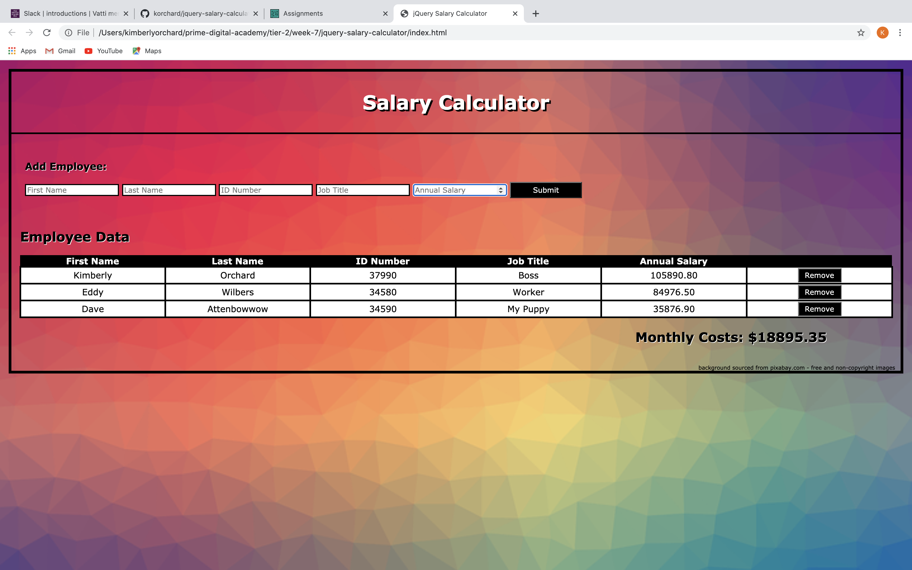
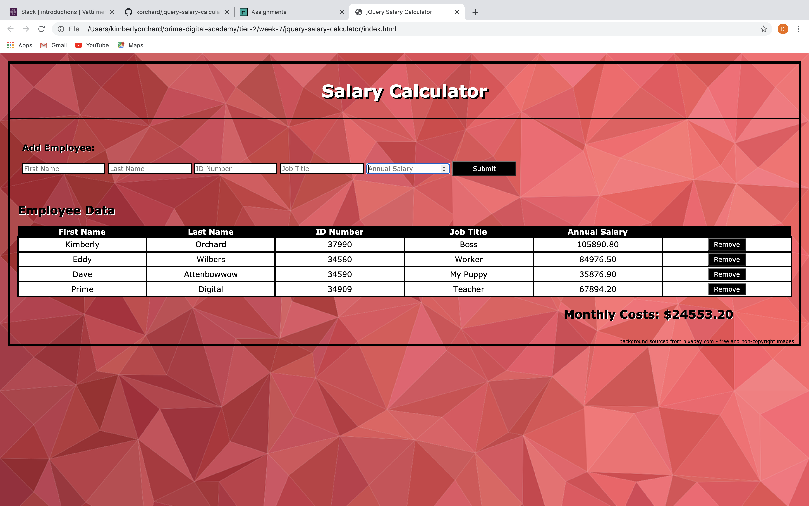

# PROJECT NAME

jQuery Salary Calculator

## Description

_Duration: Approximately 13 hours

The application has an input form that collects _employee first name, last name, ID number, job title, annual salary_.

A 'Submit' button collects the form information, stores the information to calculate monthly costs, appends information to the DOM and clears the input fields. Using the stored information, monthly costs are calculated and appended to the to DOM. If the total monthly cost exceeds $20,000, a red background will appear indicating the monthly costs have exceeded the desired amount.

There is a 'Remove' button that deletes an employee from the list of employees and adjusts the total monthly costs to reflect the changes. 

## Screen Shot

## Installation

This application is viewed and maniuplated from the browser. No installation is required.

## Usage

1. Information is inserted into the input boxes - all fields must be filled in order to add the employee to the list.
2. Press enter or click the 'submit' button to add the employee to the list of employees.
3. To remove an employee from the list, click the remove button in the row associated with that employee, their data is removed from the table, but saved globally, which could later be sourced.

## Built With

-HTML
-CSS
-JavaScript
-jQuery

## Acknowledgement
Thanks to [Prime Digital Academy](www.primeacademy.io) who equipped and helped me to make this application a reality. Thank you to Josie Fredericksen for working through this project in cooperation, I am grateful for a rubber duck buddy! Thank you to my friend, Jeff Kealy, for taking time to teach me the Why's and share with me helpful keyboard shortcuts. 

## Support
If you have suggestions or issues, please email me at on LinkedIn: linkedin.com/in/kimberly-orchard-49b0171b9
